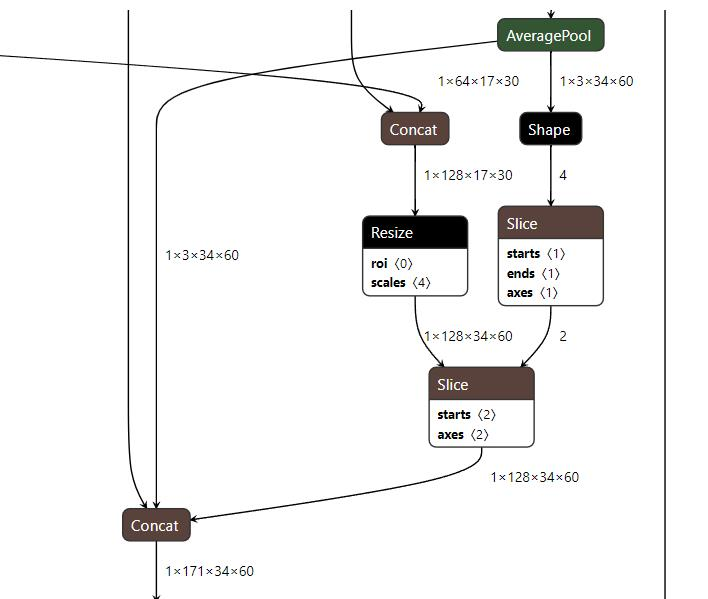
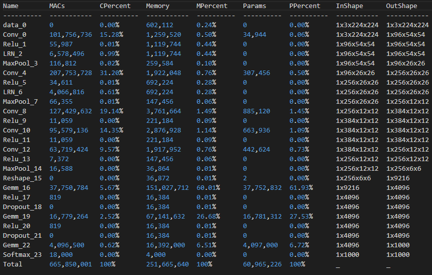
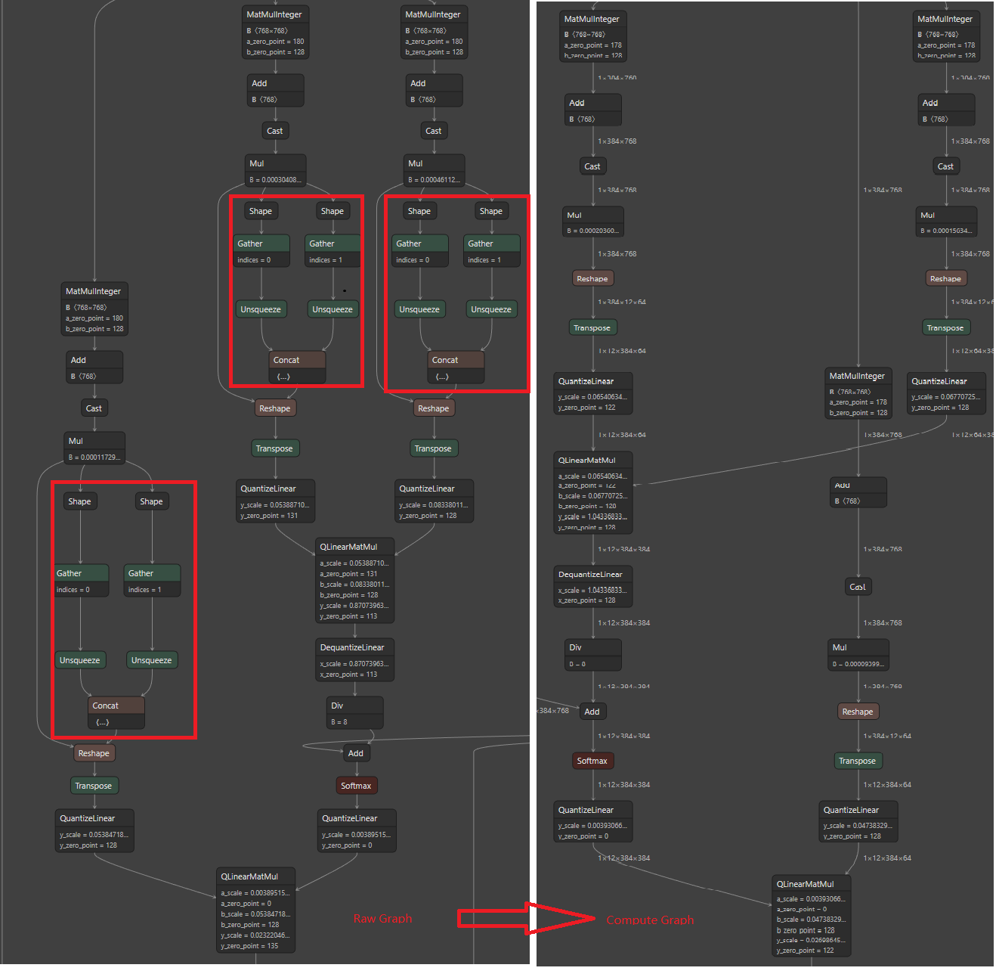

<a href="README_CN.md">简体中文</a>
# onnx-tool

**A tool for ONNX model:**
* *[Build LLM model and profile](#build-profile)*
* *[Parse and edit](#basic-parse-edit): [Constant folding](data/ConstantFolding.md); [OPs fusion](data/GraphFusion.md).*
* *[Model profiling](#shapeinfer-profile): Rapid shape inference; MACs statistics*
* *[Compute Graph and Shape Engine](#compute_graph-header).*
* *[Model memory compression](#memory-compression): activation compression and weight compression.*
* *[Quantized models and sparse models](#models) are supported.*

Supported Models:

* NLP: BERT, T5, GPT, LLaMa, MPT([TransformerModel](benchmark/transfomer_models.py))
* Diffusion: Stable Diffusion(TextEncoder, VAE, UNET)
* CV: [Detic](https://github.com/ThanatosShinji/onnx-tool/issues/63), [BEVFormer](benchmark/compression.py), [SSD300_VGG16](https://github.com/ThanatosShinji/onnx-tool/issues/66), ...
* Audio: sovits, LPCNet

---

## Build LLM model and profile

Profile 10 hugging face models within one second. Save the ONNX models as simple as llama.cpp's.
[code ref](benchmark/llm_test.py)

model name                           |            MACs |   Parameters |   KV Cache
------------------------------------ | --------------- | ------------ | ----------
gpt-j-6b                             |  28200879476736 |   6050488320 |  939524096
yi-1.5-34B                           | 155795460935680 |  34388917248 |  503316480
microsoft/phi-2                      |  14318369624064 |   2779438080 |  671088640
Phi-3-mini-4k                        |  19271345623040 |   3821079936 |  805306368
Phi-3-small-8k-instruct              |  35413741129728 |   7801672064 |  268435456
Phi-3-medium-4k-instruct             |  64542609690624 |  13960238560 |  419430400
Llama3-8B                            |  35881892564992 |   8030261248 |  268435456
Llama-3.1-70B-Japanese-Instruct-2407 | 310365865103360 |  70553706496 |  671088640
QWen-7B                              |  32919330967552 |   7615616512 |  117440512
Qwen2_72B_Instruct                   | 318393611964416 |  72706203648 |  671088640

Get first-token latency and next-token latency from hardware specs.

model_type                           |   Ultra-155H_first_latency |   Ultra-155H_next_latency |  Arc-A770_first_latency |   Arc-A770_next_latency |   H100-PCIe_first_latency |   H100-PCIe_next_latency
------------------------------------ | -------------------------- | ------------------------- |------------------------ | ----------------------- | ------------------------- | ------------------------
gpt-j-6b                             |                   1.0947   |                 0.041742  |               0.0916882 |              0.00670853 |                 0.0164015 |              0.00187839
yi-1.5-34B                           |                   5.77095  |                 0.214854  |               0.45344   |              0.0345302  |                 0.0747854 |              0.00966844
microsoft/phi-2                      |                   0.58361  |                 0.0202761 |               0.0529628 |              0.00325866 |                 0.010338  |              0.000912425
Phi-3-mini-4k                        |                   0.811173 |                 0.0277388 |               0.0745356 |              0.00445802 |                 0.0147274 |              0.00124825
Phi-3-small-8k-instruct              |                   1.38985  |                 0.0476811 |               0.117512  |              0.00766303 |                 0.0212535 |              0.00214565
Phi-3-medium-4k-instruct             |                   2.4463   |                 0.088553  |               0.198249  |              0.0142317  |                 0.0340576 |              0.00398489
Llama3-8B                            |                   1.4354   |                 0.0483954 |               0.123333  |              0.00777784 |                 0.0227182 |              0.00217779
Llama-3.1-70B-Japanese-Instruct-2407 |                  11.3541   |                 0.438114  |               0.868475  |              0.0704112  |                 0.137901  |              0.0197151
QWen-7B                              |                   1.34983  |                 0.0448417 |               0.11722   |              0.00720671 |                 0.0218461 |              0.00201788
Qwen2_72B_Instruct                   |                  11.6534   |                 0.450343  |               0.890816  |              0.0723766  |                 0.14132   |              0.0202654

---

## Basic Parse and Edit

You can load any onnx file by onnx_tool.Model:  
Change graph structure with onnx_tool.Graph;  
Change op attributes and IO tensors with onnx_tool.Node;  
Change tensor data or type with onnx_tool.Tensor.  
To apply your changes, just call save_model method of onnx_tool.Model or onnx_tool.Graph.

Please refer [benchmark/examples.py](benchmark/examples.py).

---

## Shape Inference & Profile Model

All profiling data must be built on shape inference result.  
ONNX graph with tensor shapes:

  
  

  
Regular model profiling table:  

  

  
Sparse profiling table:

  

    

Introduction: [data/Profile.md](data/Profile.md).  
pytorch usage: [data/PytorchUsage.md](data/PytorchUsage.md).  
tensorflow
usage: [data/TensorflowUsage.md](data/TensorflowUsage.md).  
examples: [benchmark/examples.py](benchmark/examples.py).

---

## Compute Graph with Shape Engine

From a raw graph to a compute graph:

  

  

Remove shape calculation layers(created by ONNX export) to get a *Compute Graph*. Use *Shape Engine* to update tensor
shapes at runtime.  
Examples: [benchmark/shape_regress.py](benchmark/shape_regress.py).
[benchmark/examples.py](benchmark/examples.py).  
Integrate *Compute Graph* and *Shape Engine* into a cpp inference
engine: [data/inference_engine.md](data/inference_engine.md)

---

## Memory Compression

### Activation Compression
Activation memory also called temporary memory is created by each OP's output. Only the last activation marked as the
model's output will be kept. So you don't have to prepare memory space for each activation tensor. They better reuse 
an optimized memory size.

For large language models and high-resolution CV models, the activation memory compression is a key to save memory.  
The compression method achieves 5% memory compression on most models.   
For example:

 model                         | Native Memory Size(MB) | Compressed Memory Size(MB) | Compression Ratio(%) 
-------------------------------|------------------------|----------------------------|----------------------
 StableDiffusion(VAE_encoder)  | 14,245                 | 540                        | 3.7                  
 StableDiffusion(VAE_decoder)  | 25,417                 | 1,140                      | 4.48                 
 StableDiffusion(Text_encoder) | 215                    | 5                          | 2.5                  
 StableDiffusion(UNet)         | 36,135                 | 2,232                      | 6.2                  
 GPT2                          | 40                     | 2                          | 6.9                  
 BERT                          | 2,170                  | 27                         | 1.25                 

code example: [benchmark/compression.py](benchmark/compression.py)

### Weight Compression
A fp32 model with 7B parameters will take 28GB disk space and memory space. You can not even run the model if your device
 doesn't have that much memory space. So weight compression is critical to run large language models. As a reference, 7B 
model with int4 symmetric per block(32) quantization(llama.cpp's q4_0 quantization method) only has ~0.156x model size compared with fp32 model. 

Current support:   
* [fp16]
* [int8]x[symmetric/asymmetric]x[per tensor/per channel/per block]  
* [int4]x[symmetric/asymmetric]x[per tensor/per channel/per block]  

code examples:[benchmark/examples.py](benchmark/examples.py).  

---

## How to install
    
`pip install onnx-tool`

OR

`pip install --upgrade git+https://github.com/ThanatosShinji/onnx-tool.git`  

python>=3.6

If `pip install onnx-tool` failed by onnx's installation, you may try `pip install onnx==1.8.1` (a lower version like this) first.  
Then `pip install onnx-tool` again.

---

## Known Issues
* Loop op is not supported
* Sequence type is not supported
  
---

## Results of [ONNX Model Zoo](https://github.com/onnx/models) and SOTA models

Some models have dynamic input shapes. The MACs varies from input shapes. The input shapes used in these results are writen to [data/public/config.py](data/public/config.py).
These onnx models with all tensors' shape can be downloaded: [baidu drive](https://pan.baidu.com/s/1eebBP-n-wXvOhSmIH-NUZQ 
)(code: p91k) [google drive](https://drive.google.com/drive/folders/1H-ya1wTvjIMg2pMcMITWDIfWNSnjYxTn?usp=sharing)

<table>
<tr>
<td>

Model | Params(M) | MACs(M)
---|---|---
<a href="benchmark/transfomer_models.py">GPT-J 1 layer</a> | 464 | 173,398  
<a href="benchmark/transfomer_models.py">MPT 1 layer</a> | 261 | 79,894
[text_encoder](https://huggingface.co/bes-dev/stable-diffusion-v1-4-onnx/tree/main)| 123.13 | 6,782
[UNet2DCondition](https://huggingface.co/bes-dev/stable-diffusion-v1-4-onnx/tree/main)| 859.52 | 888,870
[VAE_encoder](https://huggingface.co/bes-dev/stable-diffusion-v1-4-onnx/tree/main) | 34.16 | 566,371
[VAE_decoder](https://huggingface.co/bes-dev/stable-diffusion-v1-4-onnx/tree/main) | 49.49 | 1,271,959
[SqueezeNet 1.0](https://github.com/onnx/models/tree/main/vision/classification/squeezenet) | 1.23 | 351
[AlexNet](https://github.com/onnx/models/tree/main/vision/classification/alexnet) | 60.96 | 665
[GoogleNet](https://github.com/onnx/models/tree/main/vision/classification/inception_and_googlenet/googlenet) | 6.99 | 1,606
[googlenet_age](https://github.com/onnx/models/tree/main/vision/body_analysis/age_gender) | 5.98 | 1,605
[LResNet100E-IR](https://github.com/onnx/models/tree/main/vision/body_analysis/arcface) | 65.22 | 12,102
[BERT-Squad](https://github.com/onnx/models/tree/main/text/machine_comprehension/bert-squad) | 113.61 | 22,767
[BiDAF](https://github.com/onnx/models/tree/main/text/machine_comprehension/bidirectional_attention_flow) | 18.08 | 9.87
[EfficientNet-Lite4](https://github.com/onnx/models/tree/main/vision/classification/efficientnet-lite4) | 12.96 | 1,361
[Emotion](https://github.com/onnx/models/tree/main/vision/body_analysis/emotion_ferplus) | 12.95 | 877
[Mask R-CNN](https://github.com/onnx/models/tree/main/vision/object_detection_segmentation/mask-rcnn) | 46.77 | 92,077
</td>

<td>

Model | Params(M) | MACs(M)
---|-----------|---
<a href="benchmark/transfomer_models.py">LLaMa 1 layer</a> | 618       | 211,801  
[BEVFormer Tiny](https://github.com/DerryHub/BEVFormer_tensorrt) | 33.7      | 210,838
[rvm_mobilenetv3](https://github.com/PeterL1n/RobustVideoMatting) | 3.73      | 4,289
[yolov4](https://github.com/onnx/models/tree/main/vision/object_detection_segmentation/yolov4) | 64.33     | 3,319
[ConvNeXt-L](https://github.com/facebookresearch/ConvNeXt) | 229.79    | 34,872
[edgenext_small](https://github.com/mmaaz60/EdgeNeXt) | 5.58      | 1,357
[SSD](https://github.com/onnx/models/tree/main/vision/object_detection_segmentation/ssd) | 19.98     | 216,598
[RealESRGAN](https://github.com/xinntao/Real-ESRGAN) | 16.69     | 73,551
[ShuffleNet](https://github.com/onnx/models/tree/main/vision/classification/shufflenet) | 2.29      | 146
[GPT-2](https://github.com/onnx/models/tree/main/text/machine_comprehension/gpt-2) | 137.02    | 1,103
[T5-encoder](https://github.com/onnx/models/tree/main/text/machine_comprehension/t5) | 109.62    | 686
[T5-decoder](https://github.com/onnx/models/tree/main/text/machine_comprehension/t5) | 162.62    | 1,113
[RoBERTa-BASE](https://github.com/onnx/models/tree/main/text/machine_comprehension/roberta) | 124.64    | 688
[Faster R-CNN](https://github.com/onnx/models/blob/main/vision/object_detection_segmentation/faster-rcnn) | 44.10     | 46,018
[FCN ResNet-50](https://github.com/onnx/models/tree/main/vision/object_detection_segmentation/fcn) | 35.29     | 37,056
[ResNet50](https://github.com/onnx/models/tree/main/vision/classification/resnet) | 25        | 3,868

</td>
</tr>
</table>

