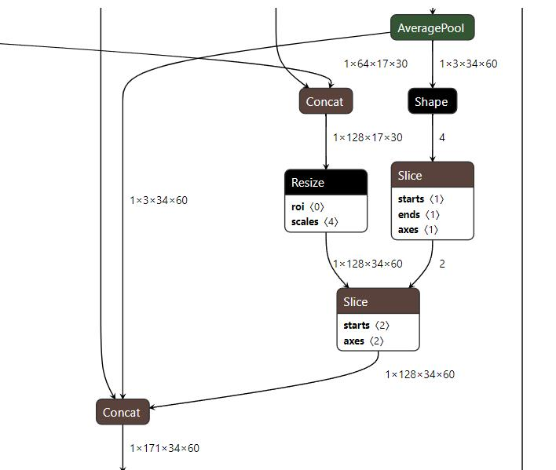
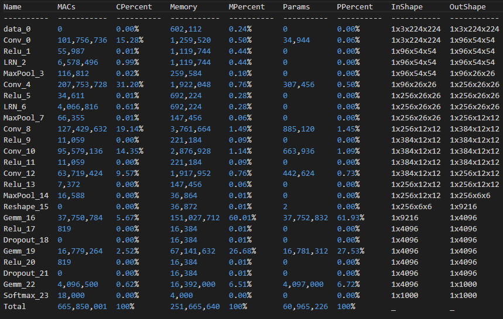
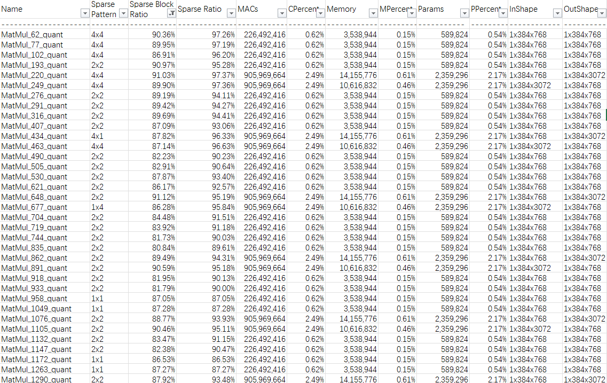
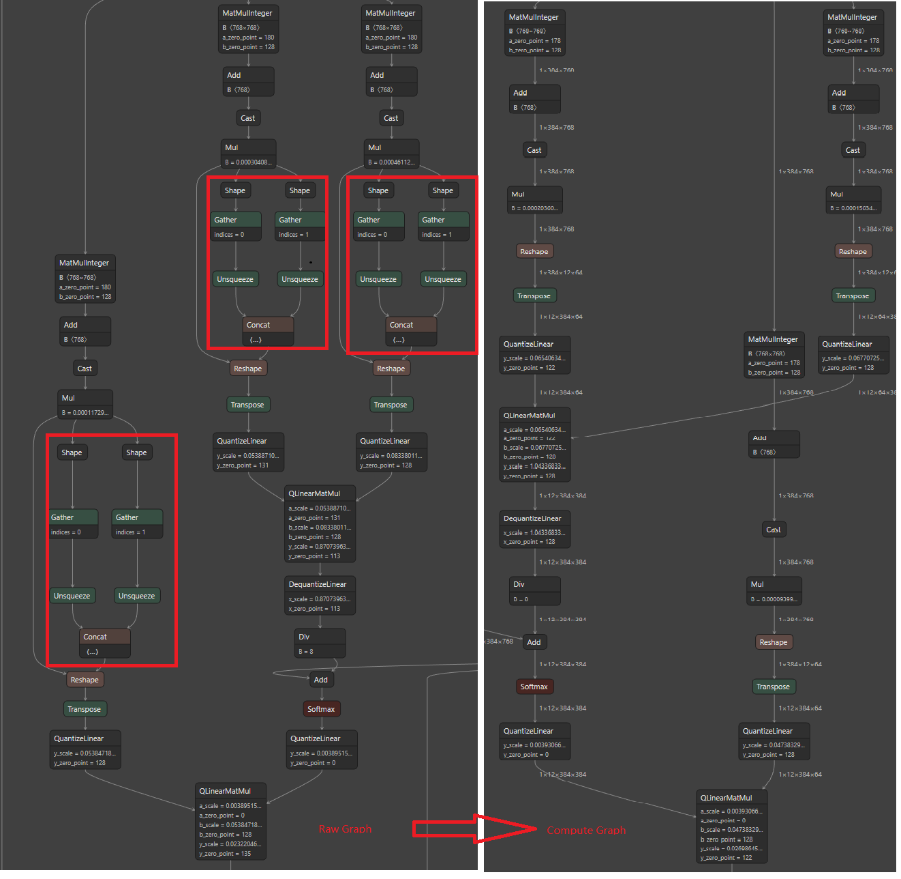

<a href="README_CN.md">📄 简体中文</a> | <a href="https://github.com/ThanatosShinji/AI-Enhancement-Filter">✨ New Project: AI-Enhancement-Filter</a> (powered by onnx-tool)

---

<p align="center">
  
  
  
</p> 

# onnx-tool

**A comprehensive toolkit for analyzing, optimizing, and transforming ONNX models** with advanced capabilities for LLMs, diffusion models, and computer vision architectures.

- **LLM Optimization**: Build and profile large language models with KV cache analysis ([example](#build-profile))
- **Graph Transformation**: 
  - Constant folding ([docs](data/ConstantFolding.md))
  - Operator fusion ([docs](data/GraphFusion.md))
- **Advanced Profiling**: 
  - Rapid shape inference
  - MACs/parameter statistics with sparsity awareness
- **Compute Graph Engine**: Runtime shape computation with minimal overhead ([details](#compute_graph-header))
- **Memory Compression**:
  - Activation memory optimization (up to 95% reduction)
  - Weight quantization (FP16, INT8/INT4 with per-tensor/channel/block schemes)
- **Quantization & Sparsity**: Full support for quantized and sparse model analysis
## 🤖 Supported Model Architectures

| Domain      | Models                                                                 |
|-------------|------------------------------------------------------------------------|
| **NLP**     | BERT, T5, GPT, LLaMa, MPT ([TransformerModel](benchmark/transfomer_models.py)) |
| **Diffusion** | Stable Diffusion (TextEncoder, VAE, UNet)                            |
| **CV**      | Detic, BEVFormer, SSD300_VGG16, ConvNeXt, Mask R-CNN, Silero VAD         |
| **Audio**   | Sovits, LPCNet                                                        |

---

## ⚡ Build & Profile LLMs in Seconds
<a id="build-profile"></a>
Profile 10 Hugging Face models in under one second. Export ONNX models with llama.cpp-like simplicity ([code](benchmark/llm_test.py)).

### Model Statistics (1k token input)
model name(1k input)                 | MACs(G) | Parameters(G) |   KV Cache(G)
------------------------------------ |---------|---------------| ----------
gpt-j-6b                             | 6277    | 6.05049       |  0.234881
yi-1.5-34B                           | 35862   | 34.3889       |  0.125829
microsoft/phi-2                      | 2948    | 2.77944       |  0.167772
Phi-3-mini-4k                        | 4083    | 3.82108       |  0.201327
Phi-3-small-8k-instruct              | 7912    | 7.80167       |  0.0671089
Phi-3-medium-4k-instruct             | 14665   | 13.9602       |  0.104858
Llama3-8B                            | 8029    | 8.03026       |  0.0671089
Llama-3.1-70B-Japanese-Instruct-2407 | 72888   | 70.5537       |  0.167772
QWen-7B                              | 7509    | 7.61562       |  0.0293601
Qwen2_72B_Instruct                   | 74895   | 72.7062       |  0.167772

### Latency Estimation (4-bit weights, 16-bit KV cache)

model_type_4bit_kv16bit              | memory_size(GB) | Ultra-155H_TTFT | Ultra-155H_TPOT |  Arc-A770_TTFT |   Arc-A770_TPOT | H100-PCIe_TTFT |   H100-PCIe_TPOT
------------------------------------ |-----------------|-----------------|-----------------|------------------------ | ----------------------- |----------------| ------------------------
gpt-j-6b                             | 3.75678         | 1.0947          | 0.041742        |               0.0916882 |              0.00670853 | 0.0164015      |              0.00187839
yi-1.5-34B                           | 19.3369         | 5.77095         | 0.214854        |               0.45344   |              0.0345302  | 0.0747854      |              0.00966844
microsoft/phi-2                      | 1.82485         | 0.58361         | 0.0202761       |               0.0529628 |              0.00325866 | 0.010338       |              0.000912425
Phi-3-mini-4k                        | 2.49649         | 0.811173        | 0.0277388       |               0.0745356 |              0.00445802 | 0.0147274      |              0.00124825
Phi-3-small-8k-instruct              | 4.2913          | 1.38985         | 0.0476811       |               0.117512  |              0.00766303 | 0.0212535      |              0.00214565
Phi-3-medium-4k-instruct             | 7.96977         | 2.4463          | 0.088553        |               0.198249  |              0.0142317  | 0.0340576      |              0.00398489
Llama3-8B                            | 4.35559         | 1.4354          | 0.0483954       |               0.123333  |              0.00777784 | 0.0227182      |              0.00217779
Llama-3.1-70B-Japanese-Instruct-2407 | 39.4303         | 11.3541         | 0.438114        |               0.868475  |              0.0704112  | 0.137901       |              0.0197151
QWen-7B                              | 4.03576         | 1.34983         | 0.0448417       |               0.11722   |              0.00720671 | 0.0218461      |              0.00201788
Qwen2_72B_Instruct                   | 40.5309         | 11.6534         | 0.450343        |               0.890816  |              0.0723766  | 0.14132        |              0.0202654
> 💡 *Latencies computed from hardware specs – no actual inference required*
> 
---

## 🔧 Basic Parsing & Editing

<a id="basic-parse-edit"></a>
Intuitive API for model manipulation:
```python
from onnx_tool import Model

model = Model('model.onnx')          # Load any ONNX file
graph = model.graph                  # Access computation graph
node = graph.nodemap['Conv_0']       # Modify operator attributes
tensor = graph.tensormap['weight']   # Edit tensor data/types
model.save_model('modified.onnx')    # Persist changes
```
See comprehensive examples in [`benchmark/examples.py`](benchmark/examples.py).

---

## 📊 Shape Inference & Profiling
<a id="shapeinfer-profile"></a>
All profiling relies on precise shape inference:

<p align="center">
  
</p>

### Profiling Capabilities
- **Standard profiling**: MACs, parameters, memory footprint
- **Sparse-aware profiling**: Quantify sparsity impact on compute
  
<p align="center">
  
  
</p>

📚 **Learn more**: 
- [Profiling Guide](data/Profile.md)
- [PyTorch Integration](data/PytorchUsage.md)
- [TensorFlow Integration](data/TensorflowUsage.md)


---

## ⚙️ Compute Graph & Shape Engine
<a id="compute_graph-header"></a>

Transform exported ONNX graphs into efficient *Compute Graphs* by removing shape-calculation overhead:

<p align="center">
  
</p>

- **Compute Graph**: Minimal graph containing only compute operations
- **Shape Engine**: Runtime shape resolver for dynamic models

**Use Cases**:
- Integration with custom inference engines ([guide](data/inference_engine.md))
- Shape regression testing ([example](benchmark/shape_regress.py))


---

## 💾 Memory Compression
<a id="memory-compression"></a>

### Activation Memory Compression
Reuses temporary buffers to minimize peak memory usage – critical for LLMs and high-res CV models.

 model                         | Native Memory Size(MB) | Compressed Memory Size(MB) | Compression Ratio(%) 
-------------------------------|------------------------|----------------------------|----------------------
 StableDiffusion(VAE_encoder)  | 14,245                 | 540                        | 3.7                  
 StableDiffusion(VAE_decoder)  | 25,417                 | 1,140                      | 4.48                 
 StableDiffusion(Text_encoder) | 215                    | 5                          | 2.5                  
 StableDiffusion(UNet)         | 36,135                 | 2,232                      | 6.2                  
 GPT2                          | 40                     | 2                          | 6.9                  
 BERT                          | 2,170                  | 27                         | 1.25                 

> ✅ Typical models achieve **>90% activation memory reduction**  
> 📌 Implementation: [`benchmark/compression.py`](benchmark/compression.py)
> 
### Weight Compression
Essential for deploying large models on memory-constrained devices:

| Quantization Scheme                     | Size vs FP32 | Example (7B model) |
|-----------------------------------------|--------------|--------------------|
| FP32 (baseline)                         | 1.00×        | 28 GB              |
| FP16                                    | 0.50×        | 14 GB              |
| INT8 (per-channel)                      | 0.25×        | 7 GB               |
| INT4 (block=32, symmetric) – llama.cpp  | 0.156×       | 4.4 GB             |

**Supported schemes**:
- ✅ FP16
- ✅ INT8: symmetric/asymmetric × per-tensor/channel/block
- ✅ INT4: symmetric/asymmetric × per-tensor/channel/block

📌 See [`benchmark/examples.py`](benchmark/examples.py) for implementation examples.


---

## 🚀 Installation
    
```bash
# PyPI (recommended)
pip install onnx-tool

# Latest development version
pip install --upgrade git+https://github.com/ThanatosShinji/onnx-tool.git
```

**Requirements**: Python ≥ 3.6

> ⚠️ **Troubleshooting**: If ONNX installation fails, try:
> ```bash
> pip install onnx==1.8.1 && pip install onnx-tool
> ```


---

## Known Issues
* Loop op is not supported
* Sequence type is not supported
  
---

## 📈 Model Zoo Results
<a id='models'></a>
Comprehensive profiling of [ONNX Model Zoo](https://github.com/onnx/models) and SOTA models. Input shapes defined in [`data/public/config.py`](data/public/config.py).

📥 **Download pre-profiled models** (with full tensor shapes):
- [Baidu Drive](https://pan.baidu.com/s/1eebBP-n-wXvOhSmIH-NUZQ) (code: `p91k`)
- [Google Drive](https://drive.google.com/drive/folders/1H-ya1wTvjIMg2pMcMITWDIfWNSnjYxTn?usp=sharing)
<p id="results" align="center">
<table>
<tr>
<td>

Model | Params(M) | MACs(M)
---|---|---
<a href="benchmark/transfomer_models.py">GPT-J 1 layer</a> | 464 | 173,398  
<a href="benchmark/transfomer_models.py">MPT 1 layer</a> | 261 | 79,894
[text_encoder](https://huggingface.co/bes-dev/stable-diffusion-v1-4-onnx/tree/main)| 123.13 | 6,782
[UNet2DCondition](https://huggingface.co/bes-dev/stable-diffusion-v1-4-onnx/tree/main)| 859.52 | 888,870
[VAE_encoder](https://huggingface.co/bes-dev/stable-diffusion-v1-4-onnx/tree/main) | 34.16 | 566,371
[VAE_decoder](https://huggingface.co/bes-dev/stable-diffusion-v1-4-onnx/tree/main) | 49.49 | 1,271,959
[SqueezeNet 1.0](https://github.com/onnx/models/tree/main/vision/classification/squeezenet) | 1.23 | 351
[AlexNet](https://github.com/onnx/models/tree/main/vision/classification/alexnet) | 60.96 | 665
[GoogleNet](https://github.com/onnx/models/tree/main/vision/classification/inception_and_googlenet/googlenet) | 6.99 | 1,606
[googlenet_age](https://github.com/onnx/models/tree/main/vision/body_analysis/age_gender) | 5.98 | 1,605
[LResNet100E-IR](https://github.com/onnx/models/tree/main/vision/body_analysis/arcface) | 65.22 | 12,102
[BERT-Squad](https://github.com/onnx/models/tree/main/text/machine_comprehension/bert-squad) | 113.61 | 22,767
[BiDAF](https://github.com/onnx/models/tree/main/text/machine_comprehension/bidirectional_attention_flow) | 18.08 | 9.87
[EfficientNet-Lite4](https://github.com/onnx/models/tree/main/vision/classification/efficientnet-lite4) | 12.96 | 1,361
[Emotion](https://github.com/onnx/models/tree/main/vision/body_analysis/emotion_ferplus) | 12.95 | 877
[Mask R-CNN](https://github.com/onnx/models/tree/main/vision/object_detection_segmentation/mask-rcnn) | 46.77 | 92,077
</td>

<td>

Model | Params(M) | MACs(M)
---|-----------|---
<a href="benchmark/transfomer_models.py">LLaMa 1 layer</a> | 618       | 211,801  
[BEVFormer Tiny](https://github.com/DerryHub/BEVFormer_tensorrt) | 33.7      | 210,838
[rvm_mobilenetv3](https://github.com/PeterL1n/RobustVideoMatting) | 3.73      | 4,289
[yolov4](https://github.com/onnx/models/tree/main/vision/object_detection_segmentation/yolov4) | 64.33     | 3,319
[ConvNeXt-L](https://github.com/facebookresearch/ConvNeXt) | 229.79    | 34,872
[edgenext_small](https://github.com/mmaaz60/EdgeNeXt) | 5.58      | 1,357
[SSD](https://github.com/onnx/models/tree/main/vision/object_detection_segmentation/ssd) | 19.98     | 216,598
[RealESRGAN](https://github.com/xinntao/Real-ESRGAN) | 16.69     | 73,551
[ShuffleNet](https://github.com/onnx/models/tree/main/vision/classification/shufflenet) | 2.29      | 146
[GPT-2](https://github.com/onnx/models/tree/main/text/machine_comprehension/gpt-2) | 137.02    | 1,103
[T5-encoder](https://github.com/onnx/models/tree/main/text/machine_comprehension/t5) | 109.62    | 686
[T5-decoder](https://github.com/onnx/models/tree/main/text/machine_comprehension/t5) | 162.62    | 1,113
[RoBERTa-BASE](https://github.com/onnx/models/tree/main/text/machine_comprehension/roberta) | 124.64    | 688
[Faster R-CNN](https://github.com/onnx/models/blob/main/vision/object_detection_segmentation/faster-rcnn) | 44.10     | 46,018
[FCN ResNet-50](https://github.com/onnx/models/tree/main/vision/object_detection_segmentation/fcn) | 35.29     | 37,056
[ResNet50](https://github.com/onnx/models/tree/main/vision/classification/resnet) | 25        | 3,868

</td>
</tr>
</table> 

## 🤝 Contributing

Contributions are welcome! Please open an issue or PR for:
- Bug reports
- Feature requests
- Documentation improvements
- New model support