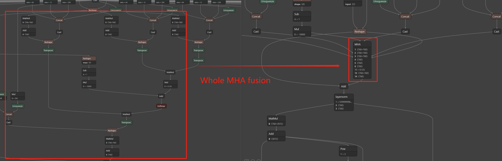
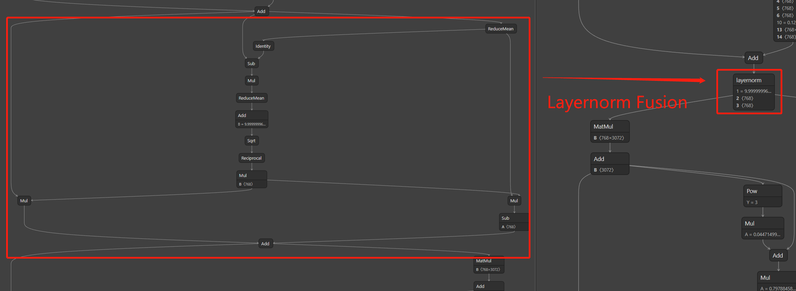
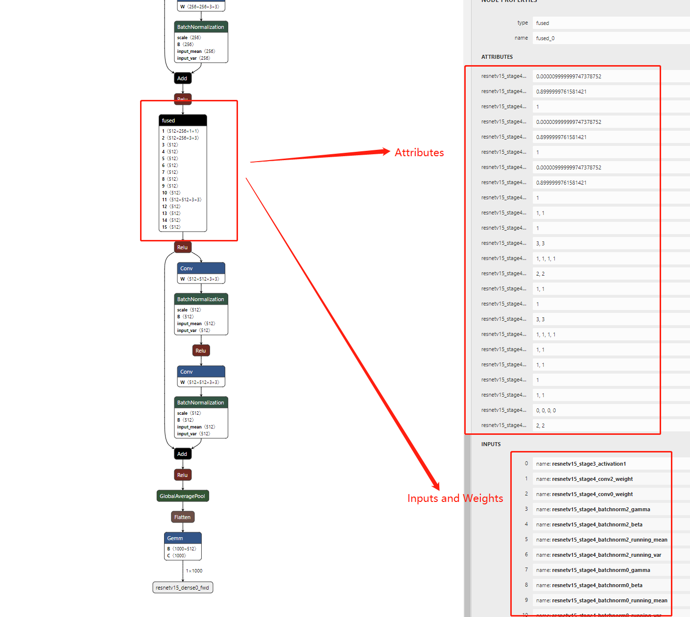
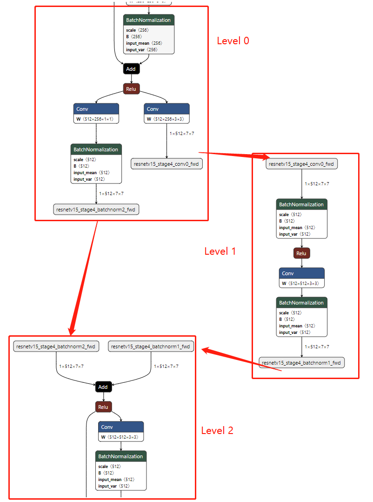

# onnx-tool

**A tool for ONNX model:**

* *快速的Tensor形状推理.*
* *分析模型每一层.*
* *<a href="data/ConstantFolding_CN.md">常量层折叠.</a>*
* *Compute Graph 和 Shape Engine.*
* *ONNX op融合.*
* *模型激活Tensor的内存压缩.*
* *支持量化模型和稀疏模型.*

支持的模型有:

* NLP: BERT, T5, GPT, LLaMa, MPT(<a href="benchmark/transfomer_models.py">TransformerModel</a>)
* Diffusion: Stable Diffusion(TextEncoder, VAE, UNET)
* CV: <a href="benchmark/compression.py">BEVFormer</a>, MobileNet, YOLO, ...
* Audio: LPCNet

---

## 形状推理

  
  

  

how to use: [data/Profile.md](data/Profile.md).  
pytorch usage: [data/PytorchUsage.md](data/PytorchUsage.md).  
tensorflow
usage: [data/TensorflowUsage.md](data/TensorflowUsage.md).  
examples: [benchmark/examples.py](benchmark/examples.py).

---

## 模型分析

  

浮点乘加数（等于2倍的浮点操作数）, 内存占用(字节数), 参数量(参数个数)  

  

稀疏的块的形状, 稀疏块的稀疏率（全为0的稀疏块的稀疏率）, 参数的稀疏率（数值为0的稀疏率）    

how to use: [data/Profile.md](data/Profile.md).  
pytorch usage: [data/PytorchUsage.md](data/PytorchUsage.md).  
tensorflow
usage: [data/TensorflowUsage.md](data/TensorflowUsage.md).  
examples: [benchmark/examples.py](benchmark/examples.py).

---

## Compute Graph with Shape Engine

  

  

移除了所有的Tensor形状计算op， 更新动态Tensor的形状可以用Shape Engine来替代。推理引擎只需要负责计算图的计算，不需要考虑Tensor的形状更新。   
examples:   
[benchmark/shape_regress.py](benchmark/shape_regress.py).  
[benchmark/examples.py](benchmark/examples.py).  
如何集成 *Compute Graph* 和 *Shape Engine* 到cpp推理引擎中: [data/inference_engine.md](data/inference_engine.md)

---

## 多OP融合为新OP

MHA and Layernorm Fusion for Transformers

  

  

Resnet18 fusion

  

how to use: [data/Subgraph.md](data/Subgraph.md).  
BERT examples: [benchmark/examples.py](benchmark/examples.py).  
Pattern fusion: [benchmark/do_fusion.py](benchmark/do_fusion.py).

---

## 从模型中提取一个子模型
可以帮助实现model parallel。

  

how to use: [data/Subgraph.md](data/Subgraph.md).

---

## Memory Compression

对于LLM和高分辨CV模型, 激活内存的压缩可以帮助节省整个模型的内存使用.  
压缩方法可以在大多数模型上实现 5% 内存压缩率.   
例如:

 model                         | Native Memory Size(MB) | Compressed Memory Size(MB) | Compression Ratio(%) 
-------------------------------|------------------------|----------------------------|----------------------
 StableDiffusion(VAE_encoder)  | 14,245                 | 540                        | 3.7                  
 StableDiffusion(VAE_decoder)  | 25,417                 | 1,140                      | 4.48                 
 StableDiffusion(Text_encoder) | 215                    | 5                          | 2.5                  
 StableDiffusion(UNet)         | 36,135                 | 2,232                      | 6.2                  
 GPT2                          | 40                     | 2                          | 6.9                  
 BERT                          | 2,170                  | 27                         | 1.25                 

code sample: [benchmark/compression.py](benchmark/compression.py)

---

## Tensor operations

* *支持模型权重的编辑和导出*
* *简化模型的op名称和Tensor名称*
* *移除模型的无用Tensor*
* *设置模型的输入输出Tensor以及形状描述*  
  how to use: [data/Tensors.md](data/Tensors.md).

---

## How to install
    
`pip install onnx-tool`

OR

`pip install --upgrade git+https://github.com/ThanatosShinji/onnx-tool.git`  

python>=3.6

If `pip install onnx-tool` failed by onnx's installation, you may try `pip install onnx==1.8.1` (a lower version like this) first.  
Then `pip install onnx-tool` again.

---

## Known Issues
* Loop op is not supported
* Activation Compression is not optimum

---

## Results of [ONNX Model Zoo](https://github.com/onnx/models) and SOTA models
注意对于支持动态输入形状的模型，模型的MACs随输入形状的改变而改变。下表中的MACs数据是基于[data/public/config.py](data/public/config.py)中的配置输入形状得到。
带有所有Tensor形状的模型和分析报告可以从下面的网盘中下载: [baidu drive](https://pan.baidu.com/s/1eebBP-n-wXvOhSmIH-NUZQ 
)(code: p91k) [google drive](https://drive.google.com/drive/folders/1H-ya1wTvjIMg2pMcMITWDIfWNSnjYxTn?usp=sharing)

<table>
<tr>
<td>

Model | Params(M) | MACs(M)
---|---|---
<a href="benchmark/transfomer_models.py">GPT-J 1 layer</a> | 464 | 173,398  
<a href="benchmark/transfomer_models.py">MPT 1 layer</a> | 261 | 79,894
[text_encoder](https://huggingface.co/bes-dev/stable-diffusion-v1-4-onnx/tree/main)| 123.13 | 6,782
[UNet2DCondition](https://huggingface.co/bes-dev/stable-diffusion-v1-4-onnx/tree/main)| 859.52 | 888,870
[VAE_encoder](https://huggingface.co/bes-dev/stable-diffusion-v1-4-onnx/tree/main) | 34.16 | 566,371
[VAE_decoder](https://huggingface.co/bes-dev/stable-diffusion-v1-4-onnx/tree/main) | 49.49 | 1,271,959
[SqueezeNet 1.0](https://github.com/onnx/models/tree/main/vision/classification/squeezenet) | 1.23 | 351
[AlexNet](https://github.com/onnx/models/tree/main/vision/classification/alexnet) | 60.96 | 665
[GoogleNet](https://github.com/onnx/models/tree/main/vision/classification/inception_and_googlenet/googlenet) | 6.99 | 1,606
[googlenet_age](https://github.com/onnx/models/tree/main/vision/body_analysis/age_gender) | 5.98 | 1,605
[LResNet100E-IR](https://github.com/onnx/models/tree/main/vision/body_analysis/arcface) | 65.22 | 12,102
[BERT-Squad](https://github.com/onnx/models/tree/main/text/machine_comprehension/bert-squad) | 113.61 | 22,767
[BiDAF](https://github.com/onnx/models/tree/main/text/machine_comprehension/bidirectional_attention_flow) | 18.08 | 9.87
[EfficientNet-Lite4](https://github.com/onnx/models/tree/main/vision/classification/efficientnet-lite4) | 12.96 | 1,361
[Emotion](https://github.com/onnx/models/tree/main/vision/body_analysis/emotion_ferplus) | 12.95 | 877
[Mask R-CNN](https://github.com/onnx/models/tree/main/vision/object_detection_segmentation/mask-rcnn) | 46.77 | 92,077
</td>

<td>

Model | Params(M) | MACs(M)
---|-----------|---
<a href="benchmark/transfomer_models.py">LLaMa 1 layer</a> | 618       | 211,801  
[BEVFormer Tiny](https://github.com/DerryHub/BEVFormer_tensorrt) | 33.7      | 210,838
[rvm_mobilenetv3](https://github.com/PeterL1n/RobustVideoMatting) | 3.73      | 4,289
[yolov4](https://github.com/onnx/models/tree/main/vision/object_detection_segmentation/yolov4) | 64.33     | 3,319
[ConvNeXt-L](https://github.com/facebookresearch/ConvNeXt) | 229.79    | 34,872
[edgenext_small](https://github.com/mmaaz60/EdgeNeXt) | 5.58      | 1,357
[SSD](https://github.com/onnx/models/tree/main/vision/object_detection_segmentation/ssd) | 19.98     | 216,598
[RealESRGAN](https://github.com/xinntao/Real-ESRGAN) | 16.69     | 73,551
[ShuffleNet](https://github.com/onnx/models/tree/main/vision/classification/shufflenet) | 2.29      | 146
[GPT-2](https://github.com/onnx/models/tree/main/text/machine_comprehension/gpt-2) | 137.02    | 1,103
[T5-encoder](https://github.com/onnx/models/tree/main/text/machine_comprehension/t5) | 109.62    | 686
[T5-decoder](https://github.com/onnx/models/tree/main/text/machine_comprehension/t5) | 162.62    | 1,113
[RoBERTa-BASE](https://github.com/onnx/models/tree/main/text/machine_comprehension/roberta) | 124.64    | 688
[Faster R-CNN](https://github.com/onnx/models/blob/main/vision/object_detection_segmentation/faster-rcnn) | 44.10     | 46,018
[FCN ResNet-50](https://github.com/onnx/models/tree/main/vision/object_detection_segmentation/fcn) | 35.29     | 37,056
[ResNet50](https://github.com/onnx/models/tree/main/vision/classification/resnet) | 25        | 3,868

</td>
</tr>
</table>

