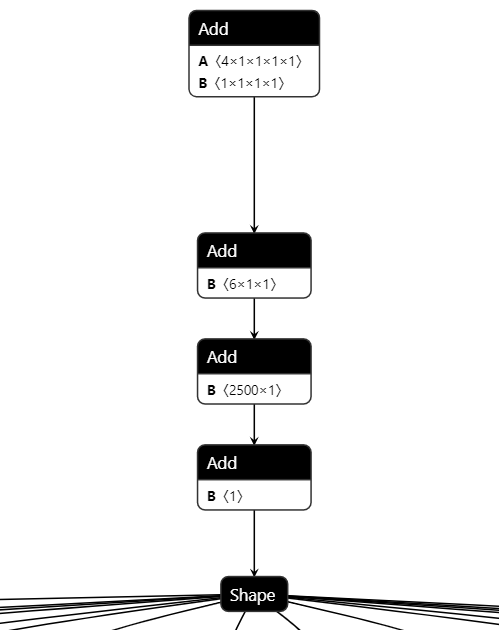

## 常量层折叠定义
ONNX的模型转换有时候很机械化，导致简单的模型结构变得异常复杂，特别是Transformer模型。可以根据层的输入Tensor的区别分为以下三种情况
### Level1-无输入层
无输入层没有任何输入，意味着他们的输出Tensor可以直接被计算出来，典型的例子就是Contant这个op。  
Contant的输出Tensor等于它属性的value对应的TensorProto。
### Level2-常量输入层
常量输入层则意味着它的输入Tensor都是常量Tensor，储存在ONNX的initializer里面。典型的例子是Identity这个op。  
Identity大多数情况下它的输入Tensor都是Graph的initializer。所以它的输出Tensor也就是等同于这个initializer的值。
### Level3-常量子图
由Level1和Level2的这两种Node组合而成的一个常量子图，子图的输入虽然是一个动态Tensor但是由于这个动态Tensor是可以通过Level1和Level2  
中的常量层计算得到的，所以它们严格来说也不算是动态Tensor，应该属于静态Tensor。
这块子图的结果完全可以预先计算成为一个静态Tensor，而不用保存在Graph中。  
下面是一个典型的例子：
<p align="left">
  
</p>
这四个Add的目的是为了生成一个4x1x6x2500x1的形状Tensor。

## 用法
python API, 很多用法都无法用命令行来完成，推荐使用python的API。
```python
import onnx_tool
rawonnx='test.onnx'
m = onnx_tool.Model(rawonnx,constant_folding=True)
m.save_model('folded.onnx')
```
cli
```commandline
python -m onnx_tool -i test.onnx -m constant_folding -o folded.onnx
```

## 典型模型
### BevFormer
GraphProto Nodes Count:7689  
Contant folding ['/Constant', '/Constant_1', '/Constant_2']... 3343 Nodes  
参考<a href="../benchmark/compression.py">复现代码</a> 
### gpt-j
GraphProto Nodes Count:1139  
Contant folding ['Identity_0', 'Identity_1', 'Identity_2']... 1029 Nodes  
参考<a href="../benchmark/transfomer_models.py">复现代码</a>  
折叠后的模型只剩原来10%的层数（原始1139层，折叠了1029层，还剩下110层），变得非常整洁。

## 可能的问题
常量折叠需要依赖于node.py中不同op对应类的value_infer的实现，目前并没有实现全部op的value_infer接口，所以  
可能遇到不支持的模型会抛出异常
```python
raise NotImplementedError(f'this Node {self.op_type}-{self.name} has no value_infer')
```
遇到这种情况你可以自己实现异常中op_type对应类的value_infer接口，或者关闭constant_folding。